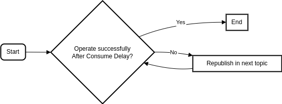

# SIMPLE CALLBACK SERVICE
This service is tasked with periodically calling the webhook of other services.

In the event that these services are unavailable, we will attempt to call them at various intervals.



## Nats JetStream Client
You can use the client/nats folder for another purposes, you can define pull-based and push-based topics and 
also you can set condition for consume delays too. 

for using that you need to create a handler and define your topics and time lines and after that you have to implement handlers 
for the events recieved from nats js.


## Testing 

You need to run nats jetstream and also you need to publish some data in to the first topic . 

for running nats run the following command.
```
    nats-server -c js.conf -js -m 9090
```

for initialize first topic with some data you can publish in the main by adding this to `main.go` :

```
	stream.Publish("CALLBACKS.callback.s10", entity.CallBackData{
		Url:  "https://webhook.site/8231308f-5beb-44e3-8ea4-05b1ead89e72",
		Data: []byte("First Message"),
	})
```


also for webhook you can use [this](https://webhook.site/), you can simply change the response code of the webhook to simulate the fail in calling callback.